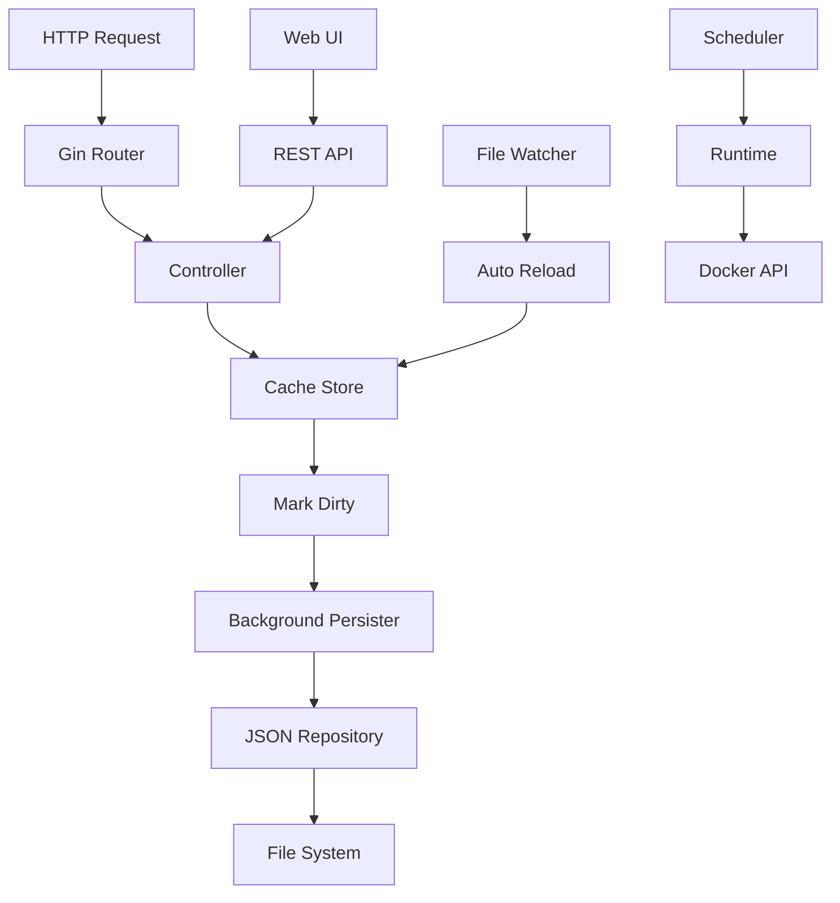

# 🐳 go_spin

**Scheduled Docker Container Management**

go_spin is a Go application for scheduled management of Docker containers. Define containers, groups, and schedules with timers to automatically start/stop containers based on configured times and days.

Thanks to [spinnerr](https://github.com/drgshub/spinnerr) project for the inspiration and design patterns.
I have decided to rewrite the project in Go to leverage its performance, concurrency model, and strong ecosystem for Docker integration and to create a solution that could be easily integrated with my [Cosmos](https://github.com/azukaar/cosmos-server
) installation. 

## ✨ Features

- **Container Management**: Register and manage Docker containers with friendly names and URLs
- **Groups**: Organize containers into logical groups for batch operations
- **Schedules**: Define time-based schedules with multiple timers per target
- **Automatic Start/Stop**: Containers are automatically started/stopped based on schedules
- **Web UI**: Modern SPA interface built with Alpine.js for visual management
- **REST API**: Full JSON API for programmatic access
- **File Watching**: Auto-reload configuration when the JSON file changes externally
- **Graceful Shutdown**: Proper cleanup on application termination

## 🚀 Quick Start

### Prerequisites

- Go 1.25.6+ 
- Docker

### Installation

```bash
# Clone the repository
git clone https://github.com/bassista/go_spin.git
cd go_spin

# Build
go build -o .build/main ./cmd/server/main.go

# Run
./.build/main
```

### Access

- **Web UI**: http://localhost:8084/ui
- **API**: http://localhost:8084/
- **Health Check**: http://localhost:8084/health

## ⚙️ Configuration

### Configuration File

Create `config/config.yaml`:

```yaml
server:
  port: 8084
  waiting_server_port: 8085
  shutdown_timeout_secs: 5
  read_timeout_secs: 10
  write_timeout_secs: 10
  idle_timeout_secs: 120

data:
  file_path: ./config/data/config.json
  persist_interval_secs: 5 #how often to persist data to file
  base_url: "http://localhost/"  # Base URL for container URL generation, supports $1 token
  spin_up_url: "http://localhost/"  # Base URL for container lazy startup URL generation supports $1 token

misc:
  scheduling_enabled: true       # Enable/disable automatic containers starting/stopping based on schedules
  scheduling_poll_interval_secs: 30
  cors_allowed_origins: "*"      # CORS origins, default "*"
```

### Environment Variables

All settings can be overridden via environment variables with prefix `GO_SPIN_`:

```bash
# Server port
PORT=8084
# Log level
GO_SPIN_MISC_LOG_LEVEL=debug
# CORS allowed origins
GO_SPIN_MISC_CORS_ALLOWED_ORIGINS=*
# Config path
GO_SPIN_CONFIG_PATH=./config
```
### Base URL for Container Links

The `baseUrl` field is used by the Web UI to auto-generate container URLs when selecting a container name:
- If `baseUrl` is empty → `http://localhost/{name}`
- If `baseUrl` does not contain `$1` → `{baseUrl}/{name}` (removes double slashes)
- If `baseUrl` contains `$1` → replaces `$1` with the container name (e.g., `https://$1.my.domain.com` → `https://Deluge.my.domain.com`)

# Waiting server port
You can configure an auxiliary "waiting" HTTP server used by the `/runtime/:name/waiting` endpoint. This server serves only the waiting HTML page (spinner + redirect) endpoint while a container or group is being started in background.

```bash
# Port used by the waiting server (default 8085)
WAITING_SERVER_PORT=8085
```

## 🔒 Security

### CORS Configuration

⚠️ **Production Warning**: The default CORS setting (`*`) allows all origins. For production environments, specify exact origins:

```yaml
misc:
  cors_allowed_origins: "http://localhost:3000,https://your-domain.com"
```

### Docker Socket Security

go_spin requires access to the Docker socket (`/var/run/docker.sock`). This grants significant privileges:

- **Development**: Use `runtime_type: memory` for testing without Docker access
- **Production**: Consider running in a restricted environment or using Docker-in-Docker
- **Container mode**: Mount Docker socket as read-only when possible
- **User Permissions**: Run go_spin under a user with limited permissions and add it to the `docker` group. Provide userId and groupId as Environment Variables when running in Docker (UID and GID environment variables).

### File System Permissions

Ensure proper permissions for:
- Configuration directory: `config/` (read-write)
- Data file: `config/data/config.json` (read-write)

```bash
# Recommended permissions
chmod 750 config/
chmod 640 config/config.yaml
chmod 660 config/data/config.json
```

---

## 🖥️ Web UI

#### GET `/ui`
Single Page Application interface.

#### GET `/ui/assets/*`
Static assets (CSS, JS, images).

The web interface provides visual management for:

| Tab | Features |
|-----|----------|
| **Containers** | List, Add, Edit, Delete, Start/Stop |
| **Groups** | List, Add, Edit, Delete, Multi-select containers |
| **Schedules** | List, Add, Edit, Delete, Full timer editor with day selection |

Access the UI at `http://localhost:8084/ui`

### UI Features

- **Real-time Status**: Container running status updates automatically
- **Bulk Operations**: Select multiple containers for group operations
- **Schedule Visualization**: Visual day selector for timer configuration
- **URL Generation**: Auto-generates container URLs based on `base_url` configuration
- **Responsive Design**: Works on desktop and mobile devices
- **Error Handling**: User-friendly error messages for failed operations

## 📡 API Endpoints

### Health
| Method | Endpoint | Description |
|--------|----------|-------------|
| GET | `/health` | Health check |

### Containers
| Method | Endpoint | Description |
|--------|----------|-------------|
| GET | `/containers` | List all containers |
| POST | `/container` | Create/update container |
| DELETE | `/container/:name` | Delete container |

### Groups
| Method | Endpoint | Description |
|--------|----------|-------------|
| GET | `/groups` | List all groups |
| POST | `/group` | Create/update group |
| DELETE | `/group/:name` | Delete group |

### Schedules
| Method | Endpoint | Description |
|--------|----------|-------------|
| GET | `/schedules` | List all schedules |
| POST | `/schedule` | Create/update schedule |
| DELETE | `/schedule/:id` | Delete schedule |


### Runtime Control
| Method | Endpoint | Description |
|--------|----------|-------------|
| GET | `/runtime/:name/status` | Check if container is running |
| POST | `/runtime/:name/start` | Start container |
| POST | `/runtime/:name/stop` | Stop container |
| GET | `/runtime/:name/waiting` | Serve waiting HTML page for a container or group (starts if not running) |

### Configuration
| Method | Endpoint | Description |
|--------|----------|-------------|
| GET | `/configuration` | Get application configuration for frontend |


### API Examples

```bash
# Health check
curl http://localhost:8084/health

# List containers
curl http://localhost:8084/containers

# Add container
curl -X POST http://localhost:8084/container \
  -H "Content-Type: application/json" \
  -d '{"name":"nginx","friendly_name":"Web Server","url":"http://localhost:8080"}'

# Start container
curl -X POST http://localhost:8084/runtime/nginx/start

# Create schedule
curl -X POST http://localhost:8084/schedule \
  -H "Content-Type: application/json" \
  -d '{
    "id": "nginx-schedule",
    "target": "nginx", 
    "targetType": "container",
    "timers": [{"startTime":"08:00","stopTime":"18:00","days":[1,2,3,4,5],"active":true}]
  }'
```

## 🔧 Troubleshooting

### Common Issues

#### Docker Connection Issues
```bash
# Check Docker daemon status
sudo systemctl status docker

# Test Docker socket access
docker info

# Check go_spin logs for Docker connection errors
./main 2>&1 | grep -i docker
```

#### Permission Errors
```bash
# Fix Docker socket permissions (Linux)
sudo usermod -aG docker $USER
# Logout and login again

# Fix config directory permissions
sudo chown -R $USER:$USER ./config/
chmod -R 755 ./config/
```

#### Port Already in Use
```bash
# Find process using port 8084
lsof -i :8084
sudo netstat -tulpn | grep :8084

# Kill process or change port
export PORT=8085
./main
```

#### Configuration File Issues
```bash
# Validate YAML syntax
yq eval config/config.yaml

# Check file permissions
ls -la config/config.yaml

# Reset to default configuration
cp config/config.yaml config/config.yaml.bak
# Create new minimal config
```

#### Schedule Not Running
1. Check `misc.scheduling_enabled: true` in configuration
2. Verify timezone setting: `misc.scheduling_timezone`
3. Check schedule format: times in HH:MM format
4. Verify days array: 0=Sunday, 1=Monday, etc.
5. Check logs for scheduling errors

#### Container Won't Start
1. Verify container name exists in Docker
2. Check container configuration in config.json
3. Verify Docker image is available
4. Check container resource requirements
5. Review Docker daemon logs

### Debug Mode

Enable debug mode for verbose logging:

```yaml
misc:
  gin_mode: debug
  log_level: debug
```

Or via environment:
```bash
GO_SPIN_MISC_GIN_MODE=debug ./main
GO_SPIN_MISC_LOG_LEVEL=debug ./main
```

---

## 🛠️ Development

### Hot Reload with Air

```bash
# Linux/macOS
air -c .air.toml

# Windows
air -c .air_win.toml
```

### Docker Development

```bash
# Development with hot-reload
docker-compose -f dev.docker-compose.yml build
docker-compose -f dev.docker-compose.yml up

# Production
docker-compose up
```

### Testing

```bash
go test ./...
```


## 📊 Coverage Report
👉 [View the coverage report here](https://bassista.github.io/go_spin/)

[](https://bassista.github.io/go_spin/)


## 🏗️ Architecture

```
go_spin/
├── cmd/server/           # Application entrypoint
├── config/               # Configuration files
│   └── data/             # JSON data storage
├── internal/
│   ├── api/
│   │   ├── controller/   # HTTP handlers (business logic)
│   │   ├── middleware/   # CORS, timeout, logging middleware
│   │   └── route/        # HTTP route definitions
│   ├── app/              # Application container (DI)
│   ├── cache/            # In-memory store with dirty tracking
│   ├── config/           # Configuration loading (Viper + validation)
│   ├── logger/           # Structured logging (logrus)
│   ├── repository/       # JSON persistence + file watching
│   ├── runtime/          # Container runtime abstractions
│   │   ├── docker/       # Docker API integration
│   │   └── memory/       # In-memory runtime for testing
│   └── scheduler/        # Time-based scheduling engine
├── ui/                   # Web UI (Alpine.js + TailwindCSS)
│   ├── index.html        # SPA entry point
│   ├── assets/app.js     # Frontend logic
│   └── templates/        # HTML templates
└── docs/                 # Documentation + API collections
```

### Architectural Patterns

#### 1. **Hexagonal Architecture (Ports & Adapters)**
- Core business logic isolated in `controller/` and `cache/`
- External dependencies abstracted via interfaces
- Runtime implementations (Docker/Memory) are interchangeable
- Repository pattern abstracts data persistence

#### 2. **Dirty Tracking Pattern**
- In-memory cache (`internal/cache/store.go`) maintains data state
- HTTP controllers mark cache as "dirty" instead of direct persistence
- Asynchronous background process persists only when changes exist
- **Benefits**: Non-blocking API responses, batched I/O operations


#### 3. **Event-Driven Persistence**
- `fsnotify` watches configuration file changes
- Auto-reload on external modifications
- Optimistic locking with `lastUpdate` timestamps
- Conflict detection and resolution


### Data Flow



### Concurrency Model

- **Main Goroutine**: HTTP server and request handling
- **Persistence Goroutine**: Periodic dirty data saving
- **File Watch Goroutine**: External configuration changes
- **Scheduler Goroutine**: Timer-based container management
- **Graceful Shutdown**: Coordinated cleanup on termination

### Key Design Decisions

| Pattern | Benefit | Trade-off |
|---------|---------|----------|
| **Async Persistence** | Fast API responses | Eventual consistency |
| **Interface Abstraction** | Testability without Docker | Additional complexity |
| **In-Memory Cache** | High performance | Memory usage |
| **File Watching** | External integration | File system dependency |
| **Polling Scheduler** | Simple implementation | Not event-driven |


### Performance Characteristics

- **API Response Time**: < 50ms for data operations (cached)
- **Container Start Time**: 1-10 seconds (depends on Docker image)
- **File Persistence**: Async, does not block API calls
- **Memory Usage**: ~20-60MB (depends on container count)
- **Scheduling Precision**: ±30 seconds (configurable poll interval)


### Resource Requirements

#### Minimum
- **CPU**: 1 core (shared)
- **RAM**: 32MB
- **Disk**: 100MB
- **Network**: 1 Mbps

#### Recommended Production
- **CPU**: 2 cores
- **RAM**: 64MB
- **Disk**: 200MB (for logs)
- **Network**: 10 Mbps


## 🚀 Production Deployment

### Docker Deployment

```yaml
# docker-compose.prod.yml
services:
  go-spin:
    image: go-spin:latest
    ports:
      - "8084:8084"
      - "8085:8085"
    volumes:
      - /var/run/docker.sock:/var/run/docker.sock
      - ./config:/app/config
    environment:
      - GO_SPIN_MISC_GIN_MODE=release
      - GO_SPIN_MISC_CORS_ALLOWED_ORIGINS=https://your-domain.com
    restart: unless-stopped
    healthcheck:
      test: ["CMD", "curl", "-f", "http://localhost:8084/health"]
      interval: 30s
      timeout: 10s
      retries: 3
```

## 📄 License

MIT License

## 🤝 Contributing

1. Fork the repository
2. Create a feature branch (`git checkout -b feature/amazing`)
3. Commit changes (`git commit -m 'feat: add amazing feature'`)
4. Push to branch (`git push origin feature/amazing`)
5. Open a Pull Request

### Development Guidelines

- **Code Style**: Follow `gofmt` and `golangci-lint` standards
- **Testing**: Maintain >80% test coverage
- **Documentation**: Update docs for new features
- **Commit Messages**: Use [Conventional Commits](https://conventionalcommits.org/)
- **Security**: No hardcoded credentials or secrets

### Pull Request Checklist

- [ ] Tests added/updated and passing
- [ ] Documentation updated
- [ ] `go vet ./...` passes
- [ ] `golangci-lint run` passes
- [ ] Breaking changes documented
- [ ] Security implications considered