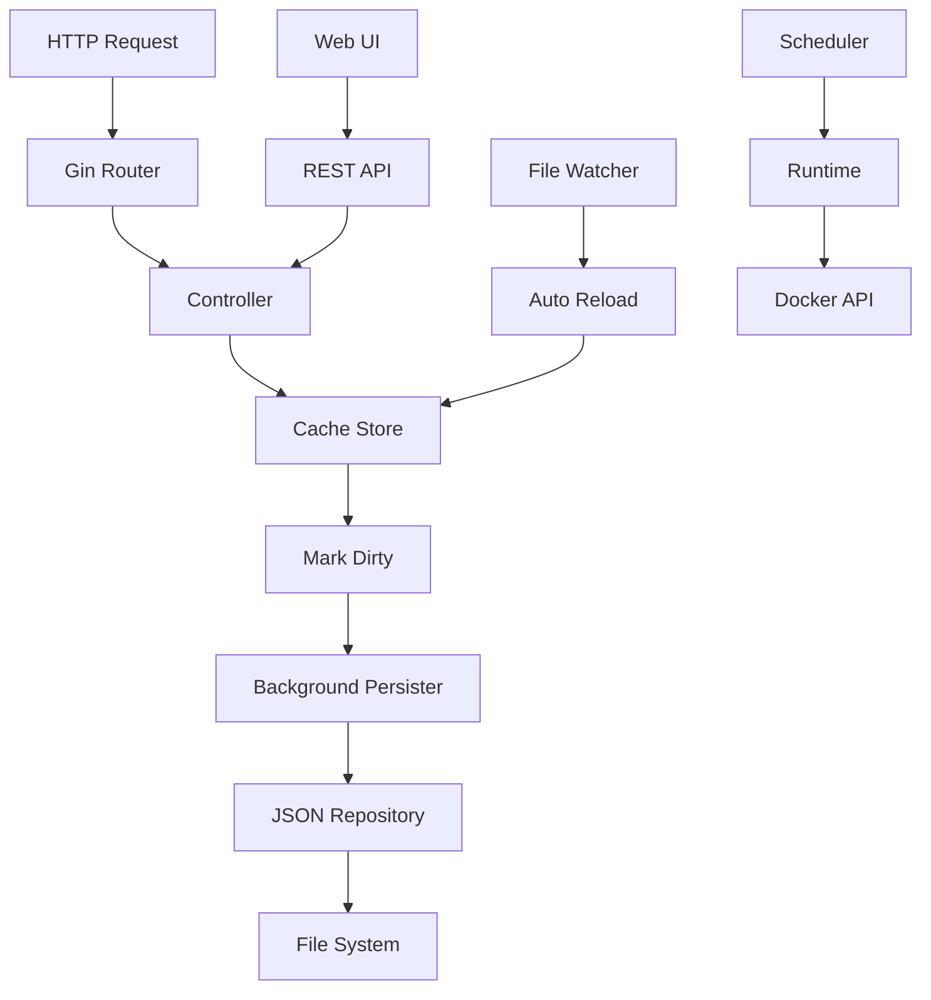

# 🐳 go_spin

**Scheduled Docker Container Management**

go_spin is a Go application for scheduled management of Docker containers. Define containers, groups, and schedules with timers to automatically start/stop containers based on configured times and days.

## ✨ Features

- **Container Management**: Register and manage Docker containers with friendly names and URLs
- **Groups**: Organize containers into logical groups for batch operations
- **Schedules**: Define time-based schedules with multiple timers per target
- **Automatic Start/Stop**: Containers are automatically started/stopped based on schedules
- **Web UI**: Modern SPA interface built with Alpine.js for visual management
- **REST API**: Full JSON API for programmatic access
- **File Watching**: Auto-reload configuration when the JSON file changes externally
- **Graceful Shutdown**: Proper cleanup on application termination

## 🚀 Quick Start

### Prerequisites

- Go 1.21+ 
- Docker

### Installation

```bash
# Clone the repository
git clone https://github.com/bassista/go_spin.git
cd go_spin

# Build
go build -o .build/main ./cmd/server/main.go

# Run
./.build/main
```

### Access

- **Web UI**: http://localhost:8084/ui
- **API**: http://localhost:8084/
- **Health Check**: http://localhost:8084/health

## ⚙️ Configuration

### Configuration File

Create `config/config.yaml`:

```yaml
server:
  port: 8084
  shutdown_timeout_secs: 5
  read_timeout_secs: 10
  write_timeout_secs: 10
  idle_timeout_secs: 120

data:
  file_path: ./config/data/config.json
  persist_interval_secs: 5
  base_url: "http://localhost/"  # Base URL for container URL generation, supports $1 token

misc:
  gin_mode: release              # "debug" or "release"
  scheduling_enabled: true
  scheduling_poll_interval_secs: 30
  scheduling_timezone: "Local"   # or "Europe/Rome", "UTC", etc.
  runtime_type: docker           # "docker" or "memory"
  cors_allowed_origins: "*"      # CORS origins, default "*"
```

### Environment Variables

All settings can be overridden via environment variables with prefix `GO_SPIN_`:

```bash
# Server port
PORT=8084

# Gin mode
GO_SPIN_MISC_GIN_MODE=debug

# Runtime type (docker or memory for testing)
GO_SPIN_MISC_RUNTIME_TYPE=docker

# CORS allowed origins
GO_SPIN_MISC_CORS_ALLOWED_ORIGINS=*

# Config path
GO_SPIN_CONFIG_PATH=./config
```

# Waiting server port
You can configure an auxiliary "waiting" HTTP server used by the `/runtime/:name/waiting` endpoint. This server serves the waiting HTML page (spinner + redirect) while a container or group is being started.

```bash
# Port used by the waiting server (default 8085)
WAITING_SERVER_PORT=8085
```

### .env File

Environment variables can be provided also via .env file.
Create a `.env` file in the project root:

```env
PORT=8084
GO_SPIN_MISC_GIN_MODE=debug
GO_SPIN_MISC_RUNTIME_TYPE=memory
GO_SPIN_MISC_SCHEDULING_ENABLED=true
GO_SPIN_DATA_PERSIST_INTERVAL_SECS=5
GO_SPIN_MISC_CORS_ALLOWED_ORIGINS=http://localhost:3000,http://localhost:8084
```

## 🔒 Security

### CORS Configuration

⚠️ **Production Warning**: The default CORS setting (`*`) allows all origins. For production environments, specify exact origins:

```yaml
misc:
  cors_allowed_origins: "http://localhost:3000,https://your-domain.com"
```

### Docker Socket Security

go_spin requires access to the Docker socket (`/var/run/docker.sock`). This grants significant privileges:

- **Development**: Use `runtime_type: memory` for testing without Docker access
- **Production**: Consider running in a restricted environment or using Docker-in-Docker
- **Container mode**: Mount Docker socket as read-only when possible

### File System Permissions

Ensure proper permissions for:
- Configuration directory: `config/` (read-write)
- Data file: `config/data/config.json` (read-write)
- Log directory (if file logging is enabled)

```bash
# Recommended permissions
chmod 750 config/
chmod 640 config/config.yaml
chmod 660 config/data/config.json
```

## 📡 API Reference

### Base URL
```
http://localhost:8084
```

### Authentication
Currently, no authentication is required. In production environments, consider implementing reverse proxy authentication.

### Content Types
- **Request**: `application/json`
- **Response**: `application/json` (except for UI and waiting endpoints)

### Standard HTTP Status Codes
- `200 OK` - Success
- `201 Created` - Resource created successfully
- `400 Bad Request` - Invalid request data
- `404 Not Found` - Resource not found
- `403 Forbidden` - Resource not active/available
- `500 Internal Server Error` - Server error

---

### Health & Status

#### GET `/health`
Basic health check endpoint.

**Response:**
```json
{
  "status": "ok",
  "timestamp": "2024-02-04T10:30:00Z"
}
```

---

### Container Management

#### GET `/containers`
Retrieve all containers with their current status.

**Response:**
```json
[
  {
    "name": "nginx",
    "friendly_name": "Web Server", 
    "url": "http://localhost:8080",
    "running": true,
    "active": true
  },
  {
    "name": "redis",
    "friendly_name": "Cache Server",
    "url": "http://localhost:6379", 
    "running": false,
    "active": true
  }
]
```

#### POST `/container`
Create or update a container configuration.

**Request Body:**
```json
{
  "name": "nginx",
  "friendly_name": "Web Server",
  "url": "http://localhost:8080",
  "active": true
}
```

**Validation Rules:**
- `name`: Required, unique identifier
- `friendly_name`: Optional display name
- `url`: Optional, must be valid URL if provided
- `active`: Boolean, defaults to true

#### DELETE `/container/:name`
Remove a container from configuration.

**Parameters:**
- `name` (path): Container name to delete

---

### Group Management

#### GET `/groups`
Retrieve all container groups.

**Response:**
```json
[
  {
    "name": "WebStack",
    "containers": ["nginx", "redis", "postgres"],
    "active": true
  }
]
```

#### POST `/group`
Create or update a container group.

**Request Body:**
```json
{
  "name": "WebStack",
  "containers": ["nginx", "redis"],
  "active": true
}
```

**Validation Rules:**
- `name`: Required, unique identifier
- `containers`: Array of existing container names
- `active`: Boolean, defaults to true

#### DELETE `/group/:name`
Remove a group from configuration.

---

### Schedule Management

#### GET `/schedules`
Retrieve all configured schedules.

**Response:**
```json
[
  {
    "id": "schedule-001",
    "target": "nginx",
    "targetType": "container",
    "timers": [
      {
        "startTime": "08:00",
        "stopTime": "18:00", 
        "days": [1, 2, 3, 4, 5],
        "active": true
      }
    ]
  }
]
```

#### POST `/schedule`
Create or update a schedule.

**Request Body:**
```json
{
  "id": "schedule-001",
  "target": "nginx",
  "targetType": "container",
  "timers": [
    {
      "startTime": "08:00",
      "stopTime": "18:00",
      "days": [1, 2, 3, 4, 5],
      "active": true
    }
  ]
}
```

**Validation Rules:**
- `target`: Must reference existing container or group
- `targetType`: Either "container" or "group"  
- `timers[].startTime/stopTime`: Format "HH:MM" (24-hour)
- `timers[].days`: Array of integers (0=Sunday, 6=Saturday)

#### DELETE `/schedule/:id`
Remove a schedule.

---

### Runtime Control

#### GET `/runtime/:name/status`
Check if a container or group is currently running.

**Response:**
```json
{
  "name": "nginx",
  "running": true,
  "containerStatuses": [
    {
      "container": "nginx",
      "running": true
    }
  ]
}
```

#### POST `/runtime/:name/start`
Start a container or all containers in a group.

**Response:**
```json
{
  "success": true,
  "message": "Container nginx started successfully",
  "details": {
    "started": ["nginx"],
    "failed": []
  }
}
```

#### POST `/runtime/:name/stop`
Stop a container or all containers in a group.

#### GET `/runtime/:name/waiting`
**Special endpoint** that serves an HTML waiting page with automatic redirect.

**Features:**
- Starts container/group if not running
- Returns HTML page with spinner
- Auto-redirects when ready
- Template variables: `{{CONTAINER_NAME}}`, `{{REDIRECT_URL}}`

**Response Codes:**
- `404` - Container/group not found
- `403` - Container/group not active
- `200` - HTML waiting page

---

### Configuration

#### GET `/configuration`
Retrieve frontend configuration settings.

**Response:**
```json
{
  "baseUrl": "https://$1.my.domain.com",
  "refreshIntervalSecs": 30,
  "schedulingEnabled": true
}
```

**Base URL Template Patterns:**
- Empty: `http://localhost/{name}`
- No `$1`: `{baseUrl}/{name}`
- With `$1`: Replace with container name

---

### Web UI

#### GET `/ui`
Single Page Application interface.

#### GET `/ui/assets/*`
Static assets (CSS, JS, images).

---

### API Examples

```bash
# Health check
curl http://localhost:8084/health

# List containers
curl http://localhost:8084/containers

# Add container
curl -X POST http://localhost:8084/container \
  -H "Content-Type: application/json" \
  -d '{"name":"nginx","friendly_name":"Web Server","url":"http://localhost:8080"}'

# Start container
curl -X POST http://localhost:8084/runtime/nginx/start

# Create schedule
curl -X POST http://localhost:8084/schedule \
  -H "Content-Type: application/json" \
  -d '{
    "id": "nginx-schedule",
    "target": "nginx", 
    "targetType": "container",
    "timers": [{"startTime":"08:00","stopTime":"18:00","days":[1,2,3,4,5],"active":true}]
  }'
```

## 📦 Data Models

### Container
```json
{
  "name": "nginx",
  "friendly_name": "Web Server",
  "url": "http://localhost:8080",
  "running": false,
  "active": true
}
```

### Group
```json
{
  "name": "WebStack",
  "container": ["nginx", "redis"],
  "active": true
}
```

### Schedule
```json
{
  "id": "schedule-001",
  "target": "nginx",
  "targetType": "container",
  "timers": [
    {
      "startTime": "08:00",
      "stopTime": "18:00",
      "days": [1, 2, 3, 4, 5],
      "active": true
    }
  ]
}
```

> **Days**: 0 = Sunday, 1 = Monday, ..., 6 = Saturday

## 🖥️ Web UI

The web interface provides visual management for:

| Tab | Features |
|-----|----------|
| **Containers** | List, Add, Edit, Delete, Start/Stop |
| **Groups** | List, Add, Edit, Delete, Multi-select containers |
| **Schedules** | List, Add, Edit, Delete, Full timer editor with day selection |

Access the UI at `http://localhost:8084/ui`

### UI Features

- **Real-time Status**: Container running status updates automatically
- **Bulk Operations**: Select multiple containers for group operations
- **Schedule Visualization**: Visual day selector for timer configuration
- **URL Generation**: Auto-generates container URLs based on `base_url` configuration
- **Responsive Design**: Works on desktop and mobile devices
- **Error Handling**: User-friendly error messages for failed operations

## 🔧 Troubleshooting

### Common Issues

#### Docker Connection Issues
```bash
# Check Docker daemon status
sudo systemctl status docker

# Test Docker socket access
docker info

# Check go_spin logs for Docker connection errors
./main 2>&1 | grep -i docker
```

#### Permission Errors
```bash
# Fix Docker socket permissions (Linux)
sudo usermod -aG docker $USER
# Logout and login again

# Fix config directory permissions
sudo chown -R $USER:$USER ./config/
chmod -R 755 ./config/
```

#### Port Already in Use
```bash
# Find process using port 8084
lsof -i :8084
sudo netstat -tulpn | grep :8084

# Kill process or change port
export PORT=8085
./main
```

#### Configuration File Issues
```bash
# Validate YAML syntax
yq eval config/config.yaml

# Check file permissions
ls -la config/config.yaml

# Reset to default configuration
cp config/config.yaml config/config.yaml.bak
# Create new minimal config
```

#### Schedule Not Running
1. Check `misc.scheduling_enabled: true` in configuration
2. Verify timezone setting: `misc.scheduling_timezone`
3. Check schedule format: times in HH:MM format
4. Verify days array: 0=Sunday, 1=Monday, etc.
5. Check logs for scheduling errors

#### Container Won't Start
1. Verify container name exists in Docker
2. Check container configuration in config.json
3. Verify Docker image is available
4. Check container resource requirements
5. Review Docker daemon logs

### Debug Mode

Enable debug mode for verbose logging:

```yaml
misc:
  gin_mode: debug
```

Or via environment:
```bash
GO_SPIN_MISC_GIN_MODE=debug ./main
```

### Health Check

Monitor application health:

```bash
# Quick health check
curl http://localhost:8084/health

# Detailed status with jq
curl -s http://localhost:8084/containers | jq '.'

# Check running containers
curl -s http://localhost:8084/containers | jq '.[] | select(.running == true)'
```

## 🛠️ Development

### Hot Reload with Air

```bash
# Linux/macOS
air -c .air.toml

# Windows
air -c .air_win.toml
```

### Docker Development

```bash
# Development with hot-reload
docker-compose -f dev.docker-compose.yml up

# Production
docker-compose up
```

### Testing

```bash
go test ./...
```


## 📊 Coverage Report
👉 [View the coverage report here](https://bassista.github.io/go_spin/)

[](https://bassista.github.io/go_spin/)


## 🏗️ Architecture

```
go_spin/
├── cmd/server/           # Application entrypoint
├── config/               # Configuration files
│   └── data/             # JSON data storage
├── internal/
│   ├── api/
│   │   ├── controller/   # HTTP handlers (business logic)
│   │   ├── middleware/   # CORS, timeout, logging middleware
│   │   └── route/        # HTTP route definitions
│   ├── app/              # Application container (DI)
│   ├── cache/            # In-memory store with dirty tracking
│   ├── config/           # Configuration loading (Viper + validation)
│   ├── logger/           # Structured logging (logrus)
│   ├── repository/       # JSON persistence + file watching
│   ├── runtime/          # Container runtime abstractions
│   │   ├── docker/       # Docker API integration
│   │   └── memory/       # In-memory runtime for testing
│   └── scheduler/        # Time-based scheduling engine
├── ui/                   # Web UI (Alpine.js + TailwindCSS)
│   ├── index.html        # SPA entry point
│   ├── assets/app.js     # Frontend logic
│   └── templates/        # HTML templates
└── docs/                 # Documentation + API collections
```

### Architectural Patterns

#### 1. **Hexagonal Architecture (Ports & Adapters)**
- Core business logic isolated in `controller/` and `cache/`
- External dependencies abstracted via interfaces
- Runtime implementations (Docker/Memory) are interchangeable
- Repository pattern abstracts data persistence

#### 2. **Dirty Tracking Pattern**
- In-memory cache (`internal/cache/store.go`) maintains data state
- HTTP controllers mark cache as "dirty" instead of direct persistence
- Asynchronous background process persists only when changes exist
- **Benefits**: Non-blocking API responses, batched I/O operations

#### 3. **Interface-Driven Design**
```go
type ContainerRuntime interface {
    Start(name string) error
    Stop(name string) error
    IsRunning(name string) bool
}

type Repository interface {
    Load() (*DataDocument, error)
    Save(*DataDocument) error
}

type AppStore interface {
    GetDocument() *DataDocument
    MarkDirty()
}
```

#### 4. **Event-Driven Persistence**
- `fsnotify` watches configuration file changes
- Auto-reload on external modifications
- Optimistic locking with `lastUpdate` timestamps
- Conflict detection and resolution

#### 5. **Factory Pattern for Runtime**
```go
runtime := runtime.NewRuntimeFromConfig(cfg.RuntimeType, store)
// Returns either DockerRuntime or MemoryRuntime
```

### Data Flow



### Concurrency Model

- **Main Goroutine**: HTTP server and request handling
- **Persistence Goroutine**: Periodic dirty data saving
- **File Watch Goroutine**: External configuration changes
- **Scheduler Goroutine**: Timer-based container management
- **Graceful Shutdown**: Coordinated cleanup on termination

### Key Design Decisions

| Pattern | Benefit | Trade-off |
|---------|---------|----------|
| **Async Persistence** | Fast API responses | Eventual consistency |
| **Interface Abstraction** | Testability without Docker | Additional complexity |
| **In-Memory Cache** | High performance | Memory usage |
| **File Watching** | External integration | File system dependency |
| **Polling Scheduler** | Simple implementation | Not event-driven |

## � Performance & Monitoring

### Key Metrics

| Metric | Endpoint | Description |
|--------|----------|-------------|
| **Health** | `GET /health` | Basic application health |
| **Container Status** | `GET /containers` | All containers with status |
| **Active Schedules** | `GET /schedules` | Currently configured schedules |

### Performance Characteristics

- **API Response Time**: < 50ms for data operations (cached)
- **Container Start Time**: 2-10 seconds (depends on Docker image)
- **File Persistence**: Async, does not block API calls
- **Memory Usage**: ~10-50MB (depends on container count)
- **Scheduling Precision**: ±30 seconds (configurable poll interval)

### Monitoring Best Practices

```bash
# Monitor application logs
tail -f go_spin.log | grep -E "ERROR|WARN"

# Check container operation times
curl -s http://localhost:8084/containers | jq '.[] | {name, running, active}'

# Monitor Docker resource usage
docker stats --format "table {{.Container}}\t{{.CPUPerc}}\t{{.MemUsage}}"

# Check schedule execution
grep -i "schedule" go_spin.log | tail -20
```

### Resource Requirements

#### Minimum
- **CPU**: 1 core (shared)
- **RAM**: 256MB
- **Disk**: 100MB
- **Network**: 1 Mbps

#### Recommended Production
- **CPU**: 2 cores
- **RAM**: 512MB
- **Disk**: 1GB (for logs)
- **Network**: 10 Mbps

### Scaling Considerations

- **Container Limit**: No hard limit, tested with 100+ containers
- **Schedule Limit**: Recommended < 50 active schedules
- **Concurrent Operations**: Limited by Docker daemon capacity
- **File I/O**: Persistence interval affects performance vs durability

## 🚀 Production Deployment

### Docker Deployment

```yaml
# docker-compose.prod.yml
version: '3.8'
services:
  go-spin:
    image: go-spin:latest
    ports:
      - "8084:8084"
    volumes:
      - /var/run/docker.sock:/var/run/docker.sock:ro
      - ./config:/app/config
      - ./data:/app/data
    environment:
      - GO_SPIN_MISC_GIN_MODE=release
      - GO_SPIN_MISC_CORS_ALLOWED_ORIGINS=https://your-domain.com
    restart: unless-stopped
    healthcheck:
      test: ["CMD", "curl", "-f", "http://localhost:8084/health"]
      interval: 30s
      timeout: 10s
      retries: 3
```

### Reverse Proxy (Nginx)

```nginx
server {
    listen 80;
    server_name your-domain.com;
    
    location / {
        proxy_pass http://localhost:8084;
        proxy_set_header Host $host;
        proxy_set_header X-Real-IP $remote_addr;
        proxy_set_header X-Forwarded-For $proxy_add_x_forwarded_for;
        proxy_set_header X-Forwarded-Proto $scheme;
    }
    
    # Increase timeout for container operations
    location /runtime/ {
        proxy_pass http://localhost:8084;
        proxy_read_timeout 300s;
        proxy_send_timeout 300s;
    }
}
```

### Systemd Service

```ini
# /etc/systemd/system/go-spin.service
[Unit]
Description=go_spin Container Manager
After=docker.service
Requires=docker.service

[Service]
Type=simple
User=gospin
Group=docker
WorkingDirectory=/opt/go-spin
ExecStart=/opt/go-spin/main
Restart=always
RestartSec=10

# Security settings
NoNewPrivileges=true
PrivateTmp=true
ProtectSystem=strict
ReadWritePaths=/opt/go-spin/config /opt/go-spin/data

[Install]
WantedBy=multi-user.target
```

## 📄 License

MIT License

## 🤝 Contributing

1. Fork the repository
2. Create a feature branch (`git checkout -b feature/amazing`)
3. Commit changes (`git commit -m 'feat: add amazing feature'`)
4. Push to branch (`git push origin feature/amazing`)
5. Open a Pull Request

### Development Guidelines

- **Code Style**: Follow `gofmt` and `golangci-lint` standards
- **Testing**: Maintain >80% test coverage
- **Documentation**: Update docs for new features
- **Commit Messages**: Use [Conventional Commits](https://conventionalcommits.org/)
- **Security**: No hardcoded credentials or secrets

### Pull Request Checklist

- [ ] Tests added/updated and passing
- [ ] Documentation updated
- [ ] `go vet ./...` passes
- [ ] `golangci-lint run` passes
- [ ] Breaking changes documented
- [ ] Security implications considered