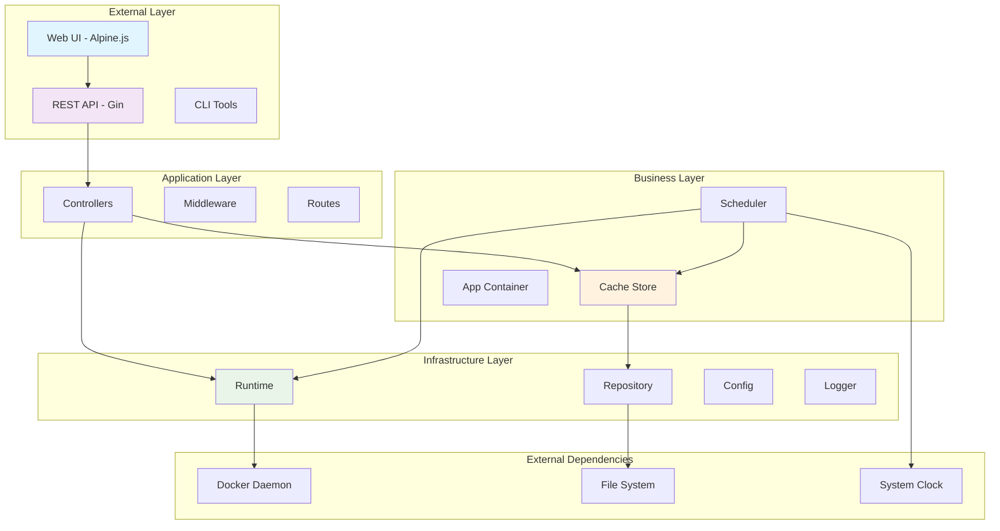
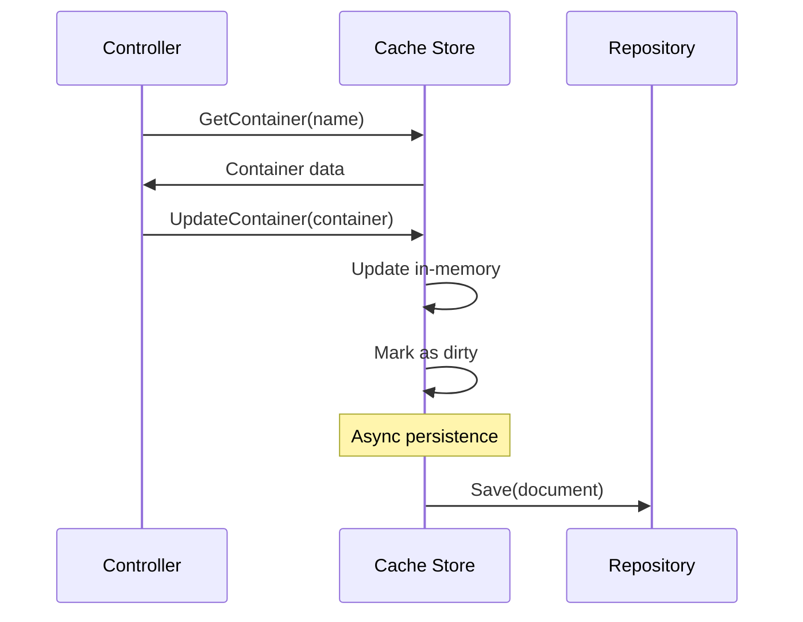
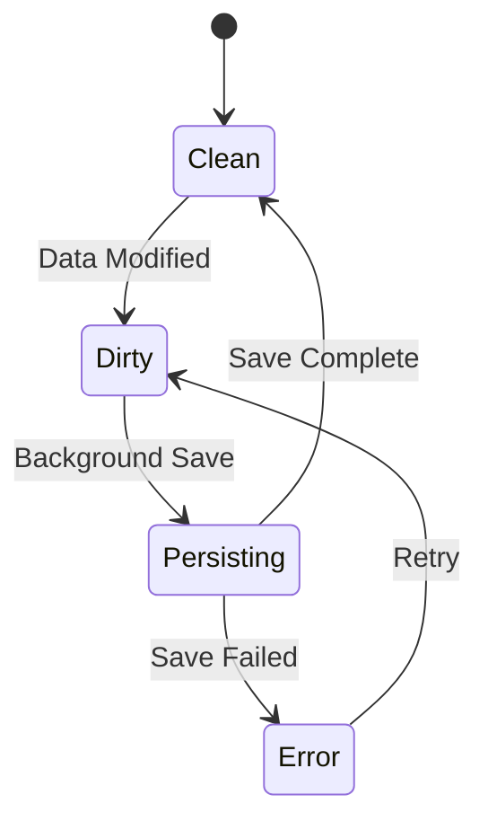
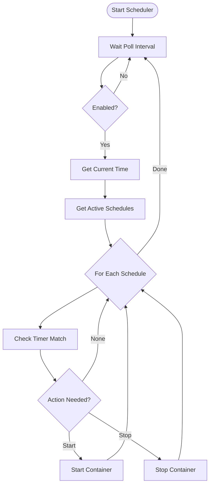
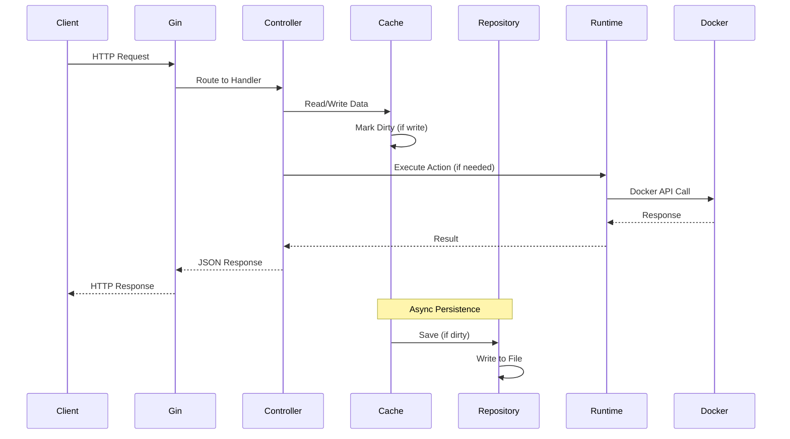
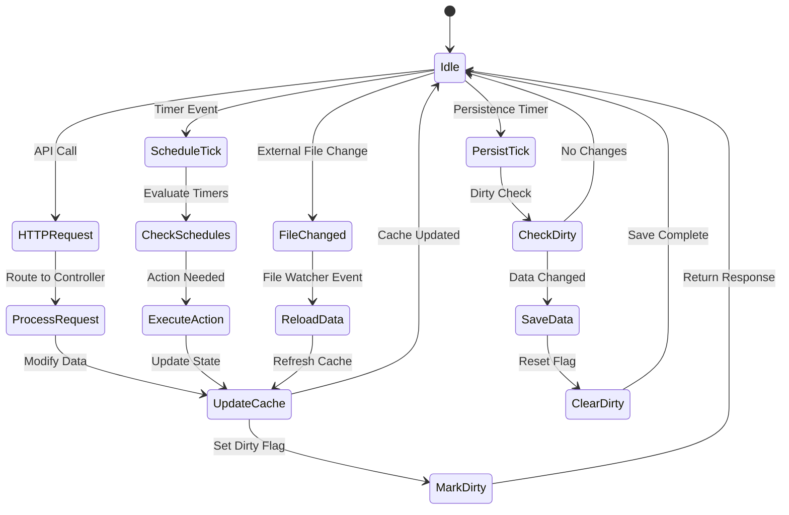

# Architecture & Design Patterns

## 🏗️ System Architecture Overview

go_spin follows a modular, interface-driven architecture that prioritizes testability, maintainability, and extensibility.

### High-Level Architecture



## 🎯 Design Principles

### 1. Separation of Concerns
Each package has a single, well-defined responsibility:
- **Controllers**: Handle HTTP requests and responses
- **Cache**: Manage in-memory data with persistence tracking
- **Runtime**: Abstract container lifecycle operations
- **Repository**: Handle data persistence and file operations
- **Scheduler**: Time-based automation logic

### 2. Dependency Inversion
High-level modules don't depend on low-level modules. Both depend on abstractions.

```go
// High-level module (Controller) depends on abstraction
type ContainerController struct {
    store   cache.AppStore          // Interface
    runtime runtime.ContainerRuntime // Interface
}

// Low-level modules implement interfaces
type DockerRuntime struct{} // Implements ContainerRuntime
type MemoryRuntime struct{} // Implements ContainerRuntime
```

### 3. Interface Segregation
Interfaces are kept minimal and focused:

```go
// Focused interface for runtime operations
type ContainerRuntime interface {
    Start(name string) error
    Stop(name string) error
    IsRunning(name string) (bool, error)
}

// Separate interface for data operations
type Repository interface {
    Load() (*DataDocument, error)
    Save(*DataDocument) error
    StartWatching(callback func()) error
}
```

### 4. Single Responsibility
Each component has one reason to change:
- **Cache**: Data storage and dirty tracking
- **Scheduler**: Time-based execution
- **Runtime**: Container operations
- **Repository**: File persistence

## 🔄 Core Patterns

### 1. Repository Pattern

**Purpose**: Abstract data access and provide a uniform interface for data operations.

**Implementation**:
```go
type Repository interface {
    Load() (*DataDocument, error)
    Save(*DataDocument) error
    StartWatching(callback func()) error
    StopWatching() error
}

type JSONRepository struct {
    filePath string
    watcher  *fsnotify.Watcher
    // ...
}
```

**Benefits**:
- Easy to test with mock implementations
- Can switch storage backends (JSON → SQL → NoSQL)
- Centralizes data access logic
- Enables file watching for external changes

### 2. Cache-Aside Pattern

**Purpose**: Improve performance by keeping frequently accessed data in memory.

**Flow**:


**Implementation**:
```go
type Store struct {
    document *DataDocument
    dirty    bool
    mu       sync.RWMutex
}

func (s *Store) UpdateContainer(container *Container) {
    s.mu.Lock()
    defer s.mu.Unlock()
    
    s.document.Containers[container.Name] = container
    s.dirty = true // Triggers async persistence
}
```

### 3. Factory Pattern

**Purpose**: Create runtime implementations based on configuration.

**Implementation**:
```go
func NewRuntimeFromConfig(runtimeType string, store cache.AppStore) (ContainerRuntime, error) {
    switch runtimeType {
    case "docker":
        client, err := client.NewClientWithOpts(
            client.FromEnv,
            client.WithAPIVersionNegotiation(),
        )
        if err != nil {
            return nil, fmt.Errorf("failed to create Docker client: %w", err)
        }
        return &DockerRuntime{client: client, store: store}, nil
        
    case "memory":
        return &MemoryRuntime{store: store}, nil
        
    default:
        return nil, fmt.Errorf("unsupported runtime type: %s", runtimeType)
    }
}
```

**Benefits**:
- Easy to add new runtime implementations
- Configuration-driven runtime selection
- Enables testing without Docker dependency

### 4. Observer Pattern (File Watching)

**Purpose**: Automatically reload configuration when external changes occur.

**Implementation**:
```go
func (r *JSONRepository) StartWatching(callback func()) error {
    watcher, err := fsnotify.NewWatcher()
    if err != nil {
        return err
    }
    
    go func() {
        for {
            select {
            case event := <-watcher.Events:
                if event.Op&fsnotify.Write == fsnotify.Write {
                    callback() // Notify of changes
                }
            case err := <-watcher.Errors:
                log.WithError(err).Error("File watcher error")
            }
        }
    }()
    
    return watcher.Add(r.filePath)
}
```

### 5. Strategy Pattern (Runtime Implementations)

**Purpose**: Switch between different container runtime strategies.

```go
// Strategy interface
type ContainerRuntime interface {
    Start(name string) error
    Stop(name string) error
    IsRunning(name string) (bool, error)
}

// Docker strategy
type DockerRuntime struct {
    client docker.APIClient
    store  cache.AppStore
}

// Memory strategy (for testing)
type MemoryRuntime struct {
    containers map[string]bool
    store      cache.AppStore
}
```

## 🧩 Component Deep Dive

### Cache Store Architecture

```go
type Store struct {
    // Core data
    document *DataDocument
    
    // State tracking
    dirty    bool
    lastSave time.Time
    
    // Concurrency control
    mu sync.RWMutex
    
    // Dependencies
    repository Repository
    logger     *logrus.Entry
}
```

**Key Features**:
- **Thread-safe**: Uses RWMutex for concurrent access
- **Dirty tracking**: Only persists when changes occur
- **Optimistic locking**: Uses timestamps to detect conflicts
- **Event-driven**: Reloads automatically on file changes

**Dirty Tracking Flow**:


### Scheduler Architecture

```go
type PollingScheduler struct {
    store        cache.AppStore
    runtime      runtime.ContainerRuntime
    pollInterval time.Duration
    timezone     *time.Location
    enabled      bool
    stopCh       chan bool
    logger       *logrus.Entry
}
```

**Scheduling Algorithm**:


**Time Handling**:
```go
func (s *PollingScheduler) shouldExecuteTimer(timer *Timer) (action string) {
    now := time.Now().In(s.timezone)
    weekday := int(now.Weekday())
    
    // Check if today is scheduled
    if !contains(timer.Days, weekday) {
        return "none"
    }
    
    // Parse start and stop times
    startTime, _ := time.Parse("15:04", timer.StartTime)
    stopTime, _ := time.Parse("15:04", timer.StopTime)
    
    // Create today's schedule times
    todayStart := time.Date(now.Year(), now.Month(), now.Day(),
        startTime.Hour(), startTime.Minute(), 0, 0, s.timezone)
    todayStop := time.Date(now.Year(), now.Month(), now.Day(),
        stopTime.Hour(), stopTime.Minute(), 0, 0, s.timezone)
    
    // Determine action based on current time
    if now.After(todayStart) && now.Before(todayStop) {
        return "start"
    } else {
        return "stop"
    }
}
```

### Runtime Abstraction

**Docker Runtime Implementation**:
```go
type DockerRuntime struct {
    client docker.APIClient
    store  cache.AppStore
    logger *logrus.Entry
}

func (d *DockerRuntime) Start(name string) error {
    // 1. Get container from store
    container := d.store.GetContainer(name)
    if container == nil {
        return ErrContainerNotFound
    }
    
    // 2. Check if already running
    running, err := d.IsRunning(name)
    if err != nil {
        return err
    }
    if running {
        return nil // Already running
    }
    
    // 3. Start container via Docker API
    err = d.client.ContainerStart(context.Background(), name, types.ContainerStartOptions{})
    if err != nil {
        return fmt.Errorf("failed to start container %s: %w", name, err)
    }
    
    // 4. Update store state
    container.Running = true
    d.store.UpdateContainer(container)
    
    d.logger.WithField("container", name).Info("Container started")
    return nil
}
```

**Memory Runtime (Testing)**:
```go
type MemoryRuntime struct {
    containers map[string]bool
    store      cache.AppStore
    mu         sync.Mutex
}

func (m *MemoryRuntime) Start(name string) error {
    m.mu.Lock()
    defer m.mu.Unlock()
    
    container := m.store.GetContainer(name)
    if container == nil {
        return ErrContainerNotFound
    }
    
    // Simulate container start
    m.containers[name] = true
    container.Running = true
    m.store.UpdateContainer(container)
    
    return nil
}
```

## 🔌 Extension Points

### Adding New Runtime Types

1. **Create Runtime Implementation**:
```go
type KubernetesRuntime struct {
    client kubernetes.Interface
    store  cache.AppStore
}

func (k *KubernetesRuntime) Start(name string) error {
    // Kubernetes-specific implementation
}
```

2. **Update Factory**:
```go
func NewRuntimeFromConfig(runtimeType string, store cache.AppStore) (ContainerRuntime, error) {
    switch runtimeType {
    case "docker":
        return NewDockerRuntime(store)
    case "memory":
        return NewMemoryRuntime(store)
    case "kubernetes":
        return NewKubernetesRuntime(store)
    // ...
    }
}
```

### Adding New Storage Backends

1. **Implement Repository Interface**:
```go
type PostgresRepository struct {
    db *sql.DB
}

func (p *PostgresRepository) Load() (*DataDocument, error) {
    // Load from PostgreSQL
}

func (p *PostgresRepository) Save(*DataDocument) error {
    // Save to PostgreSQL
}
```

2. **Update Configuration**:
```yaml
data:
  backend: "postgres"  # json, postgres, mongodb, etc.
  connection_string: "postgres://..."
```

### Adding New Middleware

```go
func AuthMiddleware() gin.HandlerFunc {
    return func(c *gin.Context) {
        // Authentication logic
        token := c.GetHeader("Authorization")
        if !isValidToken(token) {
            c.AbortWithStatus(http.StatusUnauthorized)
            return
        }
        c.Next()
    }
}

// In route setup
r.Use(middleware.AuthMiddleware())
```

## 🧪 Testing Architecture

### Test Strategy Layers

```mermaid
pyramid TB
    title Testing Pyramid
    
    subgraph "E2E Tests"
        API["API Integration Tests"]
        UI["UI Tests (Future)"]
    end
    
    subgraph "Integration Tests"
        HTTP["HTTP Handler Tests"]
        DOCKER["Docker Runtime Tests"]
        FILE["File System Tests"]
    end
    
    subgraph "Unit Tests"
        LOGIC["Business Logic"]
        UTILS["Utilities"]
        MOCK["Mock Implementations"]
    end
```

### Test Patterns

**Table-Driven Tests**:
```go
func TestContainerController_CreateContainer(t *testing.T) {
    tests := []struct {
        name           string
        input          Container
        existingData   *DataDocument
        expectedStatus int
        expectedError  string
    }{
        {
            name:           "valid new container",
            input:          Container{Name: "nginx", Active: true},
            existingData:   &DataDocument{Containers: make(map[string]*Container)},
            expectedStatus: 201,
        },
        {
            name:           "duplicate container name",
            input:          Container{Name: "nginx", Active: true},
            existingData:   &DataDocument{Containers: map[string]*Container{"nginx": {}}},
            expectedStatus: 400,
            expectedError:  "container already exists",
        },
    }
    
    for _, tt := range tests {
        t.Run(tt.name, func(t *testing.T) {
            // Test implementation
        })
    }
}
```

**Mock Interfaces**:
```go
type MockRuntime struct {
    StartFunc     func(string) error
    StopFunc      func(string) error
    IsRunningFunc func(string) (bool, error)
}

func (m *MockRuntime) Start(name string) error {
    if m.StartFunc != nil {
        return m.StartFunc(name)
    }
    return nil
}
```

**Integration Test Setup**:
```go
func setupTestApp(t *testing.T) *app.App {
    // Create temp directory for test data
    tmpDir := t.TempDir()
    
    // Create test configuration
    cfg := &config.Config{
        Data: config.DataConfig{
            FilePath: filepath.Join(tmpDir, "test.json"),
        },
        Misc: config.MiscConfig{
            RuntimeType: "memory", // Use memory runtime for tests
        },
    }
    
    // Initialize app with test dependencies
    return app.NewApp(cfg)
}
```

## 🔄 Data Flow Architecture

### Request Processing Flow



### Event Flow Architecture



This architecture documentation provides a comprehensive view of the system's design patterns, component interactions, and extension points. It serves as a guide for developers to understand the codebase structure and make informed decisions when adding new features or modifications.